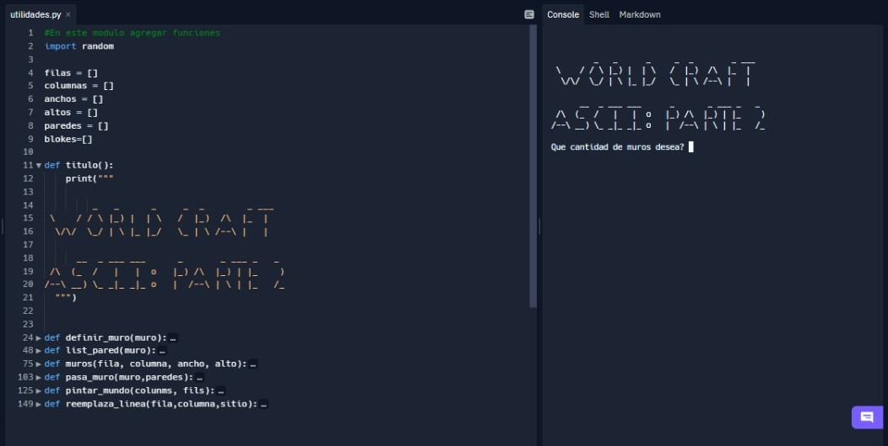
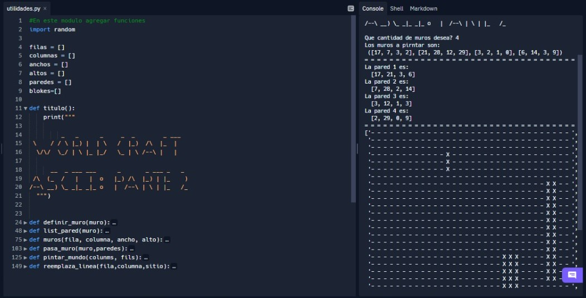
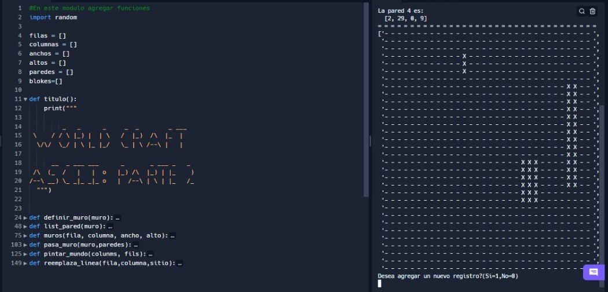

# WORLD CRAFT ASCII: PARTE 2

## Identificacion

Este reto se trata de implementar un programa que asigne cree de manera aleatoria el mundo del jugador.

## Definicion

Se debe implementar una función que recibe como entrada cuatro listas que corresponden a:
 1) lista con número de filas.
 2) lista número de columnas.
 3) lista con ancho del muro.
 4) lista con largo del muro.

Estas listas indican la fila y la columna en la que debe hacerse un muro de las dimensiones dadas, es decir retornar una lista en Python de muros.

Esta función tiene como objetivo crear una lista de posiciones en el mundo de 32 por 32 bloques en las que se encuentran los muros.

**Ejemplo:**

>muros=["0:2”,”1:0","1:1","1:2","2:1","2:2",”3:1”,”3:2”,”4:1”,”4:2”]
## Estrategias

**Ejemplo:**

*Entradas.*
+ Lista filas: = [0,3,5,6]
+ Lista columnas = [1,3,11,12]
+ Lista anchos = [2,9,1,4]
+ Lista largos = [5,2,2,1]

Estas listas representarían el siguiente mundo (que se representa como una lista de muros).
Tambien podriamos extraer los muros a dibujar.

*Muros a Dibujar.*

**La generacion de los datos se hara de manera aleatorira pidiendole al usuario solamete la cantidad de muros que desea que creemos para el nivel.**

1) Muro = [0,1,2,5]
2) Muro = [3,3,9,2]
3) Muro = [5,11,1,2]
4) Muro = [6,12,4,1]

   MURO = [F,C,A,L] => **F** son filas, **C** son columnas, **A** son anchos y **L** son largos.

De esta manera se desarrollara un construtor de muros el cual calculara todos las casillas ocupadas por el muro, para posteriormente pasarlas a una que las grafique en en mapa que se generara de 32 X 32 casillar las cuales se marcaran con una X cada vez que se le indique.

    Tablero inicial.            Tablero final.
    -----------------         ---XXXXX-----X---
    -----------------         ---X---------X---
    -----------------  === \  ---X-----X---X---
    -----------------  === /  ---X-----X---X---
    -----------------         ---------X-------
    -----------------         -----XXXXX-------

# Algoritmos

#### WORLD CRAFT ASCII: PARTE 2
**tutilo**
~~~
def titulo():
  print("""

         _   _      _     _  _        _ ___         
 \    / / \ |_) |  | \   /  |_)  /\  |_  |      
  \/\/  \_/ | \ |_ |_/   \_ | \ /--\ |   |    

      __  _ ___ ___      _       _ ___ _   _  
 /\  (_  /   |   |  o   |_) /\  |_) | |_    )
/--\ __) \_ _|_ _|_ o   |  /--\ | \ | |_   /_ 
  """)

~~~

**Ingreso de datos.**

~~~
muro = int(input("Que cantidad de muros desea? "))
~~~

**Caculo de los valores para los muros.**

~~~
def definir_muro(muro):
  """ 
	Función encarga de capturar la cantidad de muros que solicita el usuario

	Parameters
	-----------------
	muro : int
		Cantidad de muros solicitada por el jugaror

	Returns
	------------------
	Retorna el mapa
  """
  for i in range(0, muro):
      fila = int(random.randrange(31))
      filas.append(fila)
      columna = int(random.randrange(31))
      columnas.append(columna)
      ancho = int(random.randrange(abs(30-columna)+1)) 
      anchos.append(ancho)
      alto = int(random.randrange(abs(30-fila)+1))
      altos.append(alto)
  return (filas, columnas, anchos, altos)

~~~
**Extraccion de las listas de muros a pintar(pared).**
~~~
def list_pared(muro):
  """ 
	Función generar las lista de paredes que se puntaran, son las entradas basicas que el constructor recibe.

	Parameters
	-----------------
	muro : int
		Cantidad de muros solicitada por el jugaror

	Returns: list
	------------------
    Retorna las paredes lista generadas de manera aleatoria con valores (fila,columna,ancho,alto)
	"""
  for i in range(0, muro):
    pared_x = []
    f = filas[i]
    pared_x.append(f)
    c = columnas[i]
    pared_x.append(c)
    a = anchos[i]
    pared_x.append(a)
    l = altos[i]
    pared_x.append(l)
    paredes.append(pared_x)
  return paredes

~~~

**Generador de cada una de las casillas a pintar**
~~~
def muros(fila, columna, ancho, alto):
  """ 
	Función encarga de construir los muros a pintar, esta funcion es la mas importante dado que determina las casillas exactas que contiene cada pared a pintar

	Parameters
	-----------------
  fila:int
    La fila de la casilla donde iniciara el cuadro.

  columna:int
    La columna de la casilla donde iniciara el cuadro.

  ancho:int
    El desplazamiento en x del cuadro.
  
  alto:int
    El desplazamiento en y del cuadro.
	Returns:list
    coodenadas con cada una de las posiciones a dibujar en el mapa.
	------------------

	"""
  coordenadas = []
  for i in range(0, alto):
      for j in range(0, ancho):
          coordenadas.append(str(fila + i) + ":" + str(columna + j))
  return coordenadas

~~~
**Extractor de muros**
~~~
def pasa_muro(muro,paredes):
  """ 
	Función de transicion, encargada de generear la extraccion de cada una de las pociciones recibidas para pasar muro a muro al constructor

	Parameters
	-----------------
  muro:int
    cantidad de muros que extraera

  paredes:list
    lista de los muros a extraer

	Returns
	------------------
	blokes : list
		Retorna lista de elementos ordenadas para el constructor
	"""
  for i in range (0,muro):
    casilla=muros(paredes[i][0],paredes[i][1],paredes[i][2],paredes[i][3])
    blokes.append(casilla)
  return blokes

~~~
**Generador de mapa(dibujable).**
~~~
def pintar_mundo(colunms,fils):
  casillas = []
  for i in range (0,colunms):
    mundo = ("- "*fils)
    casillas.append(mundo)
  return casillas
~~~
**Pintor de muros**
~~~
def pintar_mundo(colunms, fils):
  """ 
	Función de que dibuja las casillas renglon a renglon, sin importar si sobre escribe una casilla ya marcada

	Parameters
	-----------------
  colunms:int
    Cual es la columna donde dibujara.

  fils:int
    Cual es la columna donde dibujara.

	Returns
	------------------
	casillas : list
		Retorna linea con las marcas indicadas.
	"""
  casillas = []
  for i in range(0, colunms):
      mundo = ("- " * fils)
      casillas.append(mundo)
  return casillas

~~~
**Reemplaza linea**
~~~
def reemplaza_linea(fila,columna,sitio):
  """ 
	Función que reemplaza la linea dibujada por pintar:mundo()

	Parameters
	-----------------
  filas:int
    Cual es la filas donde dibujara.

  columna:int
    Cual es la columna donde dibujara.
  
  sitio:int
    Cual es la sitio(mapa) donde dibujara.

	Returns
	------------------
	sitio : list
		Retorna el mapa con los muros marcados
	"""
  nfila = sitio[fila].split()
  nfila.pop(columna)
  nfila.insert(columna,'X')
  nfila.append("")
  sitio[fila]=" ".join(nfila)

  return sitio
~~~

# Logros

